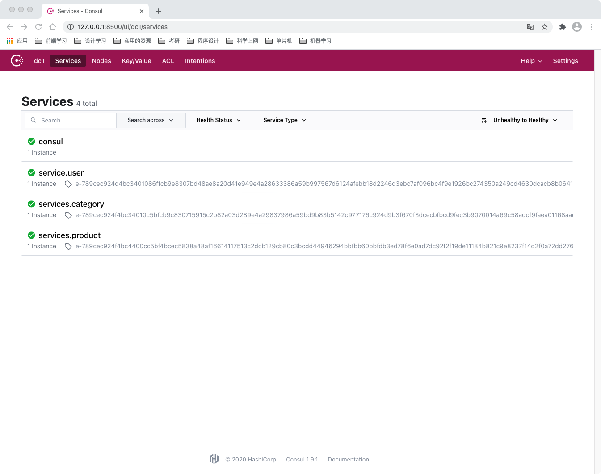
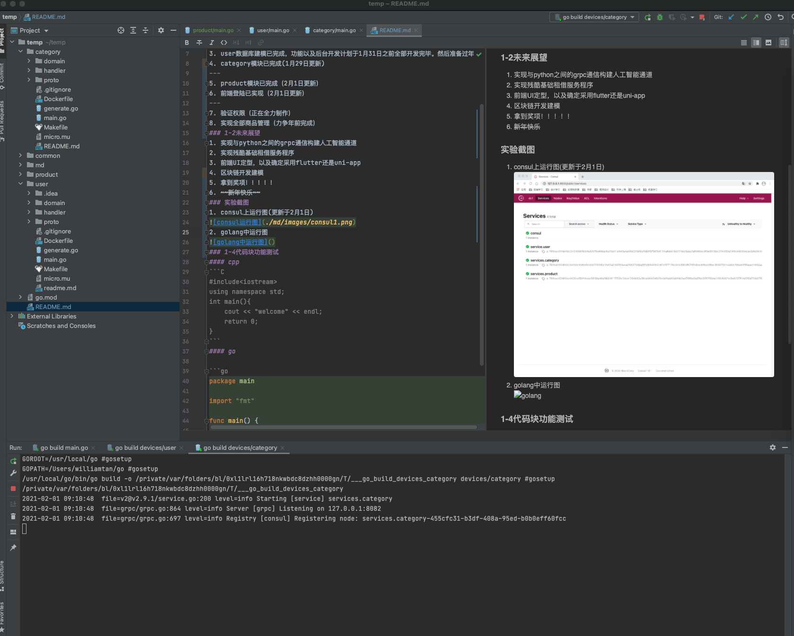

# 食用说明
## 一.开发进度
### 1-1进度说明
1. 目前已实现在consul上部署微服务（1月28日更新）
2. user基础建表已解决
3. user数据库建模已完成，功能以及后台开发计划于1月31日之前全部开发完毕。然后准备过年。
4. category模块已完成(1月29日更新)  
---
5. product模块已完成（2月1日更新）
6. 前端登陆已实现（2月1日更新）
---
7. 验证权限（正在全力制作）
8. 实现全部商品管理（力争年前完成）
### 1-2未来展望
1. 实现与python之间的grpc通信构建人工智能通道
2. 实现残酷基础租借服务程序
3. 前端UI定型，以及确定采用flutter还是uni-app
4. 区块链开发建模
5. 拿到奖项！！！！！
6. ~~新年快乐~~
### 实验截图
1. consul上运行图(更新于2月1日)  
  
2. golang中运行图  

### 1-4代码块功能测试
#### cpp
```C
#include<iostream>
using namespace std;
int main(){
    cout << "welcome" << endl;
    return 0;
}
```
#### go

```go
package main

import "fmt"

func main() {
	fmt.Println("welcome")
}
```